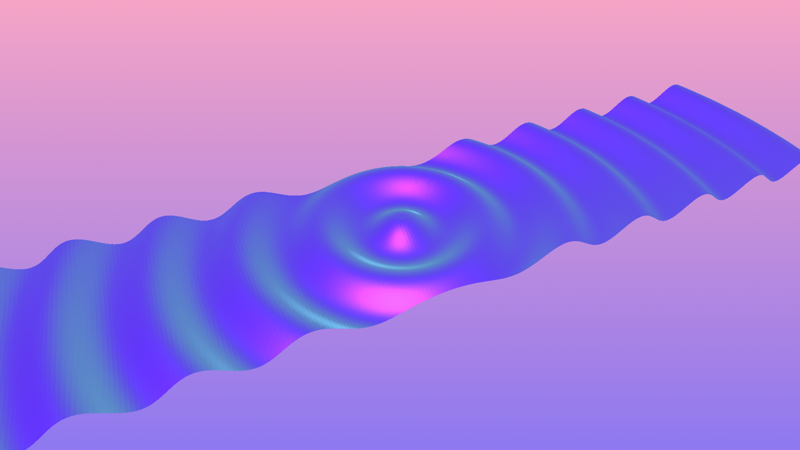

# Experiment 1

## Sine Waves in THREE.js
This wave pattern is accomplished by calculating a sine wave from the centre of the PlaneGeometry through to the other vertices. For each vertex, calculate the distance from the centre point. Using that distance apply the sin to get the vertical positions of the vertex. Then use time (ts) to create the wave animation. Additionally, there are two variables *size* and *magnitude* that allow us to manipulate the vertical deviation and wave length.

## Initial setup
- `npm install --global gulp-cli` : Install gulp globally
- `npm i` Install dependencies

## Building for development
- `gulp dev` : Build files will be output to the '.tmp' directory.

## Building for production
- `gulp build` : Build files will be output to the 'deploy' directory.

## Pushing a new release
- `gulp build` : Compile local changes
- `git add .` : Stage changes
- `git commit -m"change description"` : comment on your changes
- `git tag -a v1.0.0 -m "Change description"` : Add a new tagged release
- `git push --follow-tags` : Push staged changes and tags
